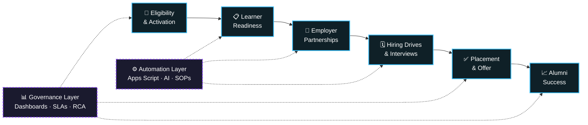

<div align="center">


<a href="https://linkedin.com/in/abhishesh-kumar">
  
</a>

<br/>

<a href="https://sant1513.github.io/portfolio/"></a>
<a href="https://drive.google.com/file/d/151GY4RS9Lvl4EB-9064ib-1L82kF2t4E/view?usp=sharing"></a>
<a href="https://linkedin.com/in/abhishesh-kumar"></a>
<a href="mailto:abhisheshuu@gmail.com?subject=Opportunity%20for%20Abhishesh%20Kumar%20%E2%80%94%20%5BRole%5D%20at%20%5BCompany%5D&body=Hi%20Abhishesh%2C%0A%0AI%20came%20across%20your%20profile%20and%20would%20like%20to%20speak%20with%20you%20about%20an%20opening%20on%20our%20team.%0A%0ARole%3A%0ACompany%3A%0ALocation%20%2F%20work%20model%3A%0ATeam%20size%20and%20scope%3A%0AWhat%20the%20role%20owns%3A%0A%0AA%20little%20on%20why%20I%20think%20it%27s%20a%20fit%3A%20your%20background%20in%20placement%20and%20program%20operations%20%E2%80%94%20and%20the%20automation%20and%20governance%20work%20behind%20it%20%E2%80%94%20lines%20up%20closely%20with%20what%20we%20need.%0A%0AWould%20you%20be%20open%20to%20a%20short%20intro%20call%20this%20week%3F%20Happy%20to%20work%20around%20your%20schedule.%0A%0ABest%20regards%2C%0A%5BYour%20name%5D%0A%5BTitle%2C%20Company%5D%0A%5BPhone%20%2F%20LinkedIn%5D"></a>


</div>

---

## `> whoami`

```yaml
name:        Abhishesh Kumar
role:        Senior Operations Manager  ·  Operations & Strategy Leader
current:     Masai School — Operations & Placements
experience:  6+ years  ·  Business Ops · Placement Ops · Program Ops
focus:       process excellence, AI-driven automation, operational governance
philosophy:  "If it can't be measured, it can't be scaled."
```

Operations & Strategy leader with **6+ years** building and running the machinery behind high-growth
organizations — placement functions, learning operations, and cross-functional governance. I design
systems that turn ambiguous, manual workflows into instrumented, automated, and *measurably* better ones.

---

## `> impact --dashboard`

<div align="center">

<table>
<tr>
<td align="center" width="20%">
<h2>2,200+</h2>
<sub><b>LEARNERS</b><br/>placement ops owned<br/>end-to-end</sub>
</td>
<td align="center" width="20%">
<h2>1,000+</h2>
<sub><b>PLACEMENTS</b><br/>enabled via employer<br/>engagement</sub>
</td>
<td align="center" width="20%">
<h2>₹2.5 Cr+</h2>
<sub><b>MONTHLY REVENUE</b><br/>Pan-India operations<br/>supported</sub>
</td>
<td align="center" width="20%">
<h2>180+</h2>
<sub><b>WORKFORCE</b><br/>largest field team<br/>managed</sub>
</td>
<td align="center" width="20%">
<h2>10+</h2>
<sub><b>OPS PROS</b><br/>direct team<br/>led &amp; mentored</sub>
</td>
</tr>
</table>

<br/>

<table>
<tr>
<th align="left">Metric</th><th align="center">Baseline</th><th align="center">After</th><th align="center">Movement</th>
</tr>
<tr><td>Learner progression rate</td><td align="center">—</td><td align="center"><b>95%+</b></td><td align="center">🟢 up</td></tr>
<tr><td>Course dropout</td><td align="center">—</td><td align="center"><b>&lt;5%</b></td><td align="center">🟢 down</td></tr>
<tr><td>Placement workflow</td><td align="center">manual</td><td align="center"><b>automated + governed</b></td><td align="center">🟢 redesigned</td></tr>
<tr><td>Revenue leakage / fraud</td><td align="center">reactive</td><td align="center"><b>controlled &amp; detected</b></td><td align="center">🟢 hardened</td></tr>
<tr><td>Reporting cadence</td><td align="center">ad-hoc sheets</td><td align="center"><b>live exec dashboards</b></td><td align="center">🟢 productized</td></tr>
</table>

</div>

---

## `> operating_model --render`



<div align="center"><sub><i>The placement engine I own — and the two layers that keep it honest.</i></sub></div>

---

## `> experience --timeline`

<details open>
<summary><b>🏢 &nbsp;MASAI SCHOOL</b> &nbsp;·&nbsp; <i>Dec 2022 — Present</i> &nbsp;·&nbsp; <code>L3 → L2 → L1</code></summary>

<br/>

### `▍` Manager L1 — Operations & Placements &nbsp;&nbsp;<sub>`Jul 2025 – Present`</sub>

- Own **end-to-end placement operations for 2,200+ learners** across Software Development, Data, QA and emerging tech — enabling **1,000+ placements** through strategic employer engagement and operational excellence.
- Own the operational strategy for Masai's **Placement vertical**: employer partnerships, company onboarding, virtual/offline hiring drives, placement events, and the full learner lifecycle from eligibility to placement.
- Lead **cross-functional teams** across Placement, Career Coaching, Business Development, Alumni Success and Employer Operations — redesigning job recommendations, resume clearance, interview scheduling, learner activation and governance.
- Drive operational governance via policy implementation, executive reporting, high-priority escalations, learner grievance resolution and cross-functional stakeholder management.

### `▍` Program Operations Manager — L2 &nbsp;&nbsp;<sub>`Apr 2024 – Jun 2025`</sub>

- Led **Central Operations** for academic programs, managing a **team of 6** across Evaluations, MUI, Plagiarism Governance, Construct Week, Instructor Ratings, External Payouts and learner progression.
- Built **executive dashboards**, standardized SOPs, and shipped automation using **Looker Studio, Metabase, Google Sheets and Apps Script**.
- Partnered with Product, Academics, Business and Outcomes to lift learner progression to **95%+** while cutting course dropout to **under 5%**.

### `▍` Program Operations Manager — L3 &nbsp;&nbsp;<sub>`Dec 2022 – Mar 2024`</sub>

- Re-engineered core operational processes for execution consistency, scalability and governance across programs.
- Led learning operations for **2,600+ students**, managing and mentoring a **team of 10+** operations professionals.
- Delivered career-readiness and interview-prep initiatives that materially improved learner confidence, employability and placement readiness.
- Built leadership dashboards in **Google Data Studio + Metabase** tracking cohort health, learner progress and risk indicators.
- Ran structured **FGDs** with underperforming cohorts to surface root causes and deploy data-backed corrective plans.

</details>

<details>
<summary><b>🚀 &nbsp;AWIGN</b> &nbsp;·&nbsp; <i>Dec 2020 — Sep 2022</i> &nbsp;·&nbsp; <code>Associate → Sr. Associate → Sr. Analyst</code></summary>

<br/>

### `▍` Sr. Analyst — Operations &nbsp;&nbsp;<sub>`Jan 2022 – Sep 2022`</sub>

- Supported **10+ large-scale Pan-India operations** contributing **₹2.5 Cr+ in monthly revenue** through operational excellence and process optimization.
- Strengthened **fraud detection and revenue-leakage controls** while streamlining workflows into automation-ready, standardized frameworks.
- Built automated dashboards and MIS reporting in **Google Data Studio and Metabase**, converting raw operational data into decision-grade insight.

### `▍` Sr. Associate — Operations &nbsp;&nbsp;<sub>`Oct 2021 – Dec 2021`</sub>

- Led expansion for **5+ enterprise clients**, driving market penetration, operational scale and revenue growth across regions.
- Managed and mentored a **180+ member Urban Ambassador workforce**, consistently hitting productivity, conversion and SLA targets.
- Implemented **RCA-driven** process improvements with Product, Client Success and Operations.

### `▍` Associate — Operations &nbsp;&nbsp;<sub>`Dec 2020 – Sep 2021`</sub>

- Executed expansion strategies across **12+ projects**, partnering with Product and Tech to build scalable operational workflows.
- Leveraged market research, geo-specific data and analytics to improve capacity planning and operational visibility.

</details>

---

## `> toolkit`

<div align="center">

**Analytics & BI**


**Automation & AI**


</div>

<br/>

<div align="center">
<table>
<tr>
<td valign="top" width="25%">

**⚙️ Business Ops**

`Operations Strategy`
`Placement Operations`
`Program Management`
`Process Excellence (DMAIC)`

</td>
<td valign="top" width="25%">

**🧭 Leadership**

`Cross-Functional Leadership`
`Stakeholder Management`
`Team Leadership`
`Operational Governance`

</td>
<td valign="top" width="25%">

**📊 Analytics**

`Data Analytics`
`MIS & Reporting`
`Business Intelligence`
`Root Cause Analysis`

</td>
<td valign="top" width="25%">

**🤖 Automation**

`Workflow Automation`
`AI Enablement`
`Process Digitization`
`Revenue Optimization`

</td>
</tr>
</table>
</div>

---

## `> how_i_work`

<details>
<summary><b>🔍 &nbsp;1. Diagnose before I build</b></summary>

<br/>

Every fix starts with **RCA and FGDs**, not a dashboard. I sit with the cohort, the field team, or the
escalation log until the actual failure mode is obvious — then I build exactly one thing to remove it.

</details>

<details>
<summary><b>📐 &nbsp;2. Standardize, then automate</b></summary>

<br/>

Automating a broken process just makes it fail faster. SOPs and clear ownership come first;
**Apps Script, AI, and workflow tooling** come second. That ordering is why the automation sticks.

</details>

<details>
<summary><b>📈 &nbsp;3. Instrument everything</b></summary>

<br/>

If leadership has to ask "how are we doing?", the system has already failed.
**Live Looker Studio / Metabase dashboards** with cohort health, SLA adherence and risk indicators —
so the conversation starts at *"why"*, never at *"what"*.

</details>

<details>
<summary><b>🛡️ &nbsp;4. Govern the edges</b></summary>

<br/>

Scale breaks at the exceptions. Escalation paths, grievance resolution, plagiarism governance,
fraud and leakage controls — the unglamorous guardrails that keep a 2,000+ person system trustworthy.

</details>

---

## `> github --stats`

<div align="center">


<br/>


</div>

---

## `> education`

<div align="center">

| Qualification | Institution | Years |
|:--|:--|:--:|
| **M.Sc.** | CSJMU | 2020 – 2022 |
| **B.Sc.** | University of Allahabad, Prayagraj | 2017 – 2020 |
| **Secondary & Senior Secondary (XII)** | Army Public School, Bathinda Cantt | 2015 – 2017 |

</div>

---

## `> connect`

<div align="center">

**Open to conversations on operations strategy, placement &amp; program ops, and AI-driven process automation.**

<br/>

<a href="https://sant1513.github.io/portfolio/"></a>
<a href="https://drive.google.com/file/d/151GY4RS9Lvl4EB-9064ib-1L82kF2t4E/view?usp=sharing"></a>
<a href="https://linkedin.com/in/abhishesh-kumar"></a>
<a href="mailto:abhisheshuu@gmail.com?subject=Opportunity%20for%20Abhishesh%20Kumar%20%E2%80%94%20%5BRole%5D%20at%20%5BCompany%5D&body=Hi%20Abhishesh%2C%0A%0AI%20came%20across%20your%20profile%20and%20would%20like%20to%20speak%20with%20you%20about%20an%20opening%20on%20our%20team.%0A%0ARole%3A%0ACompany%3A%0ALocation%20%2F%20work%20model%3A%0ATeam%20size%20and%20scope%3A%0AWhat%20the%20role%20owns%3A%0A%0AA%20little%20on%20why%20I%20think%20it%27s%20a%20fit%3A%20your%20background%20in%20placement%20and%20program%20operations%20%E2%80%94%20and%20the%20automation%20and%20governance%20work%20behind%20it%20%E2%80%94%20lines%20up%20closely%20with%20what%20we%20need.%0A%0AWould%20you%20be%20open%20to%20a%20short%20intro%20call%20this%20week%3F%20Happy%20to%20work%20around%20your%20schedule.%0A%0ABest%20regards%2C%0A%5BYour%20name%5D%0A%5BTitle%2C%20Company%5D%0A%5BPhone%20%2F%20LinkedIn%5D"></a>

<br/><br/>


</div>
